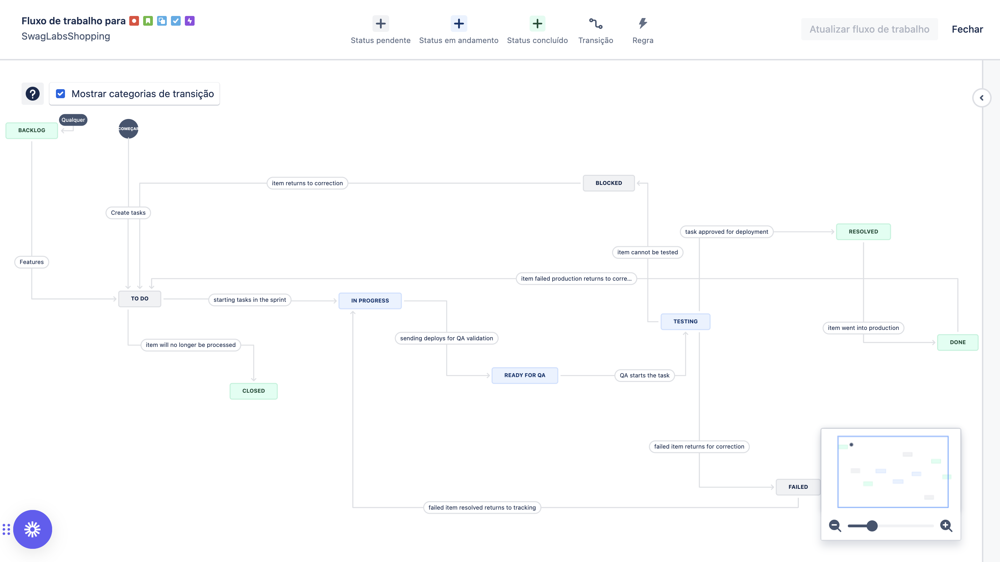

# 📌 Fluxo de Trabalho do Projeto no Jira

## 📖 Visão Geral

Este documento descreve o fluxo de trabalho utilizado no Jira para gerenciar as tarefas do projeto. O objetivo é garantir um processo organizado e eficiente, permitindo rastreamento adequado do progresso das atividades.

## 🔄 Status das Tarefas

Cada tarefa pode passar pelos seguintes estados:

- **Backlog**: Onde todas as tarefas (issues) são criadas e priorizadas antes de serem trabalhadas.
- **To Do (A Fazer)**: Tarefas prontas para serem executadas, mas ainda não iniciadas.
- **In Progress (Em Progresso)**: Tarefas que estão sendo trabalhadas ativamente.
- **Ready for QA**: Tarefas finalizadas e prontas para testes de qualidade.
- **Testing (Testando)**: Tarefas em fase de execução de testes (manuais ou automatizados).
- **Blocked (Bloqueado)**: Tarefas impedidas de prosseguir devido a algum problema ou dependência.
- **Failed (Falhou)**: Tarefas em que os testes falharam e precisam ser corrigidas.
- **Resolved (Resolvido)**: Tarefas corrigidas e aguardando aprovação final.
- **Done (Concluído)**: Tarefas finalizadas com sucesso e aprovadas.
- **Closed (Fechado)**: Tarefas finalizadas permanentemente sem necessidade de reabertura.

## 🔀 Transições Entre Status

As tarefas podem seguir o seguinte fluxo:

1. **Backlog → To Do**: Quando uma tarefa é priorizada e está pronta para ser trabalhada.
2. **To Do → Closed**: Se a tarefa for cancelada ou arquivada sem execução.
3. **To Do → In Progress**: Quando alguém inicia a execução da tarefa.
4. **In Progress → Ready for QA**: Quando a tarefa está pronta para ser testada.
5. **Ready for QA → Testing**: A tarefa entra na fase de testes.
6. **Testing → Blocked**: Se um problema impedir a continuidade dos testes.
7. **Testing → Failed**: Se os testes falharem, a tarefa volta para correção.
8. **Testing → Resolved**: Se a correção for aplicada e a tarefa estiver pronta para reavaliação.
9. **Blocked → To Do**: Se a tarefa precisar ser reiniciada desde o início.
10. **Failed → In Progress**: Após a falha, a tarefa retorna para desenvolvimento.
11. **Resolved → Done**: Se a tarefa for aprovada após a correção.
12. **Done → To Do**: Se for necessário reabrir uma tarefa concluída.

## 🚀 Ciclo Completo da Tarefa

1. A tarefa é criada no **Backlog**.
2. É priorizada e movida para **To Do**.
3. Se cancelada, vai para **Closed**. Caso contrário, inicia e vai para **In Progress**.
4. Quando finalizada, a tarefa vai para **Ready for QA**.
5. A tarefa entra na fase de **Testing**.
6. Se um bloqueio impedir a execução dos testes, vai para **Blocked**.
7. Se falhar nos testes, vai para **Failed** e depois retorna para **In Progress** para correção.
8. Após a correção, a tarefa vai para **Resolved** e passa por nova avaliação.
9. Se a correção for aprovada, a tarefa vai para **Done**.
10. A tarefa pode ser **Closed** ou reaberta movendo de **Done** para **To Do**.

## 📂 Como Contribuir

- Sempre siga o fluxo de trabalho definido para garantir rastreabilidade.
- Atualize corretamente o status das tarefas conforme o andamento.
- Comunique bloqueios ou falhas identificadas durante os testes.
- Utilize comentários nas issues para documentar decisões importantes.

---

📌 _Este documento deve ser mantido atualizado conforme houver mudanças no fluxo de trabalho do projeto._
